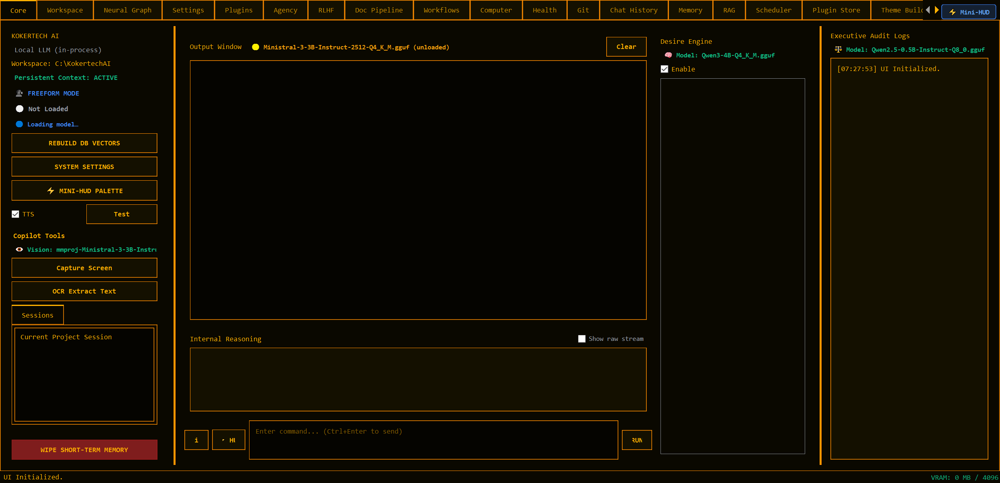

# KokertechAI

[](https://github.com/StallionNz/KokertechAI/actions/workflows/ci.yml)
[](LICENSE)
[](https://www.python.org/downloads/)

**An offline-first, local-only AI desktop automation system.**

KokertechAI is a Windows desktop application that runs a fully local large
language model in-process, gives it tools, persistent memory, and multi-agent
reasoning, and wraps the whole thing in a native GUI, a rich terminal, and a web
interface. Nothing is sent to a cloud inference provider — the model runs on your
machine, and your data stays on your disk.

It is built as a JARVIS-style digital assistant rather than a chat box: it drives
the desktop, indexes your documents, maintains a long-term memory graph, and can
chain all of that together through a YAML workflow engine.



---

## Highlights

- **100% local inference** — a single in-process provider (`ai_base.LocalLLMProvider`)
  backed by `llama-cpp-python` and GGUF models. No cloud inference endpoints.
- **Three interfaces** — a PyQt6 desktop dashboard, an interactive terminal with
  slash commands, and a web (Flask / FastAPI) front end.
- **28 built-in plugins** — file I/O, web + document research, OCR, screen
  capture, memory storage, script execution, and more, loaded at startup.
- **3-tier persistent memory** — short-term history, an episodic session journal,
  and long-term core memories with embeddings, hybrid search (vector + FTS5 BM25
  fused with RRF), and a GraphRAG knowledge graph.
- **Multi-agent reasoning** — 7 specialist sub-agent personas (Researcher,
  Coder, Auditor, Planner, ToolUser, Orchestrator, Synthesizer), an intent router,
  and optional speculative/hive orchestration.
- **Workflow engine** — YAML pipelines with `plugin_command`, `sub_agent`,
  `crew`, and `sandbox` action types plus `depends_on` graphs.
- **Local-first privacy** — no telemetry. The network is touched only when you
  invoke a tool that needs it (web search, page fetch, webhook).
- **Guarded by a test suite and 12 pre-flight quality gates** that run in CI and
  locally.

## Requirements

- **Windows** (the app drives the desktop, uses Windows credential storage, and
  resolves its data root to a fixed path).
- **Python 3.10+** (developed against 3.13 / 3.14).
- A **GGUF model** for llama-cpp-python. The default configuration targets
  `Ministral-3-3B-Instruct-2512-Q4_K_M.gguf`.
- Optional: Docker (for the code sandbox), Tesseract (OCR), Piper voices (TTS).

> **Path note:** `config.py` automatically resolves the workspace directory to the
> repository checkout location (`os.path.dirname(__file__)`). You can also override
> it by setting the `KOKERTECH_WORKSPACE_DIR` environment variable.

## Installation

### Option 1: One-Click Windows Setup (Recommended)
Simply double-click or run:
```bat
install.bat
```
This script creates your `.venv`, installs requirements, creates a Desktop shortcut with `kokertech.ico`, and offers to download a starter GGUF model.

### Option 2: Manual Setup
```bash
git clone https://github.com/StallionNz/KokertechAI.git
cd KokertechAI

python -m venv .venv
source .venv/Scripts/activate      # Git Bash on Windows (or .venv\Scripts\Activate.ps1)

pip install -r requirements.txt

# Download a tested starter model into models/
python scripts/download_starter_model.py
```

Optional extras that are imported lazily and skipped when absent:

```bash
pip install crewai langchain-openai   # CrewAI orchestration (Python < 3.14)
```

Copy the example environment file if you want to override defaults:

```bash
cp .env.example .env
```

## Quick start

```bash
python main.py                 # PyQt6 desktop dashboard
python kokertech_terminal.py   # interactive CLI
python kokerpro_web.py         # Flask web interface
```

Or use the Windows launcher:

```bat
kokertechai                :: interactive CLI (default)
kokertechai gui            :: desktop dashboard
kokertechai web            :: web interface
kokertechai download-model :: download starter GGUF model into models/
kokertechai gates          :: run pre-flight quality gates
kokertechai test           :: run CLI test subset
```

## Architecture

```
                 INTERFACE LAYER
   PyQt6 GUI  |  Terminal CLI  |  Flask / FastAPI Web
        \            |              /
         \           v             /
            APPLICATION LAYER
   config · plugin_registry · ai_base · memory_vault
   kokertechController (orchestration facade)
   sub_agents · workflow_engine · services/ · tabs/
                    |
                    v
                DATA LAYER
    kokertech_vault.db (SQLite) · app_settings.json
```

`kokertechController` is a thin orchestration facade over six extracted services
(history, context, prompt, provider, settings cache, provider stream). The AI,
memory, and plugin subsystems are described in depth in
[`KNOWLEDGE.md`](KNOWLEDGE.md).

## Configuration

Runtime settings live in `app_settings.json` (145 keys by default) and are
surfaced through the Settings tab. Notable groups:

- **Resource limits** — VRAM / RAM / disk warning and critical thresholds.
- **Inference** — active provider, model name, structured vs. freeform mode,
  grammar hot-reload, KV-cache reuse.
- **Tool use** — per-tool timeout, retries, destructive-action confirmation,
  sandbox limits, audit logging.
- **Memory** — hybrid-search weight, embedding batch size, WAL checkpointing.

Secrets (API keys, etc.) can be supplied via `.env`; on first load they migrate
to the Windows Credential Manager and keyring takes priority thereafter.

## Plugins

Plugins live in `plugins/` and self-register at startup. Each exports
`COMMAND_NAME`, `execute(intent_json)`, and optionally `SCHEMA` and
`PLUGIN_METADATA`. The model sees a category summary first and requests full
schemas on demand via `<<LOAD_TOOLS:category>>` (progressive disclosure).

Current set (28): screen capture, intent classification, folder/file creation,
delegation, script execution, audio + image text extraction, web fetch and
search, DOCX/Excel/PDF reading, document indexing, knowledge-graph linking, bias
and growth logging, MCP client, file listing/reading/renaming, research,
semantic search, memory storage, system status, tool use, webhooks, and writes.

## Testing

```bash
python -m pytest                          # full suite (parallel, chunk-aware)
python scripts/run_parallel_chunked.py    # chunked runner for very large suites
python scripts/run_all_gates.py           # 12 pre-flight quality gates
```

The gate suite covers markdown rendering, anchor resolution, doc hygiene, test
count regression, lint baselines, silent-catch drift, singleton-reset patterns,
corruption recurrence, continuity, doc drift, and config-mode pins. Gates exit
`0` (clean), `1` (violation), or `3` (skipped — input doc absent).

## Repository layout

| Path | Contents |
|------|----------|
| `main.py`, `app_core.py`, `app_ui.py`, `app_hotkeys.py`, `app_lifecycle.py`, `app_plugins.py` | Desktop dashboard entry point and mixins |
| `kokertechController.py` | AI orchestration facade |
| `ai_base.py` | Local LLM provider, caching, grammars, circuit breaker |
| `memory_vault.py` | SQLite 3-tier memory + hybrid search + GraphRAG |
| `plugin_registry.py`, `plugins/` | Plugin system and the 28 native plugins |
| `sub_agents.py`, `workflow_engine.py`, `crew_integration.py`, `docker_sandbox.py` | Agent + workflow orchestration |
| `services/` | Extracted service layer (DI container + 16 services) |
| `tabs/` | 24 PyQt6 tab modules |
| `cli/`, `kokertech_terminal.py` | Terminal interface and slash commands |
| `kokerpro_web.py`, `kokerpro_fastapi.py` | Web interfaces |
| `scripts/` | Quality gates, maintenance, and DR tooling |
| `tests/` | pytest suite |
| `agent/`, `.agents/` | Agent behavior contracts and local skills |

## License

Released under the **GNU Affero General Public License v3.0** — see [`LICENSE`](LICENSE).

KokertechAI is developed by Kokertech Pty Ltd.
